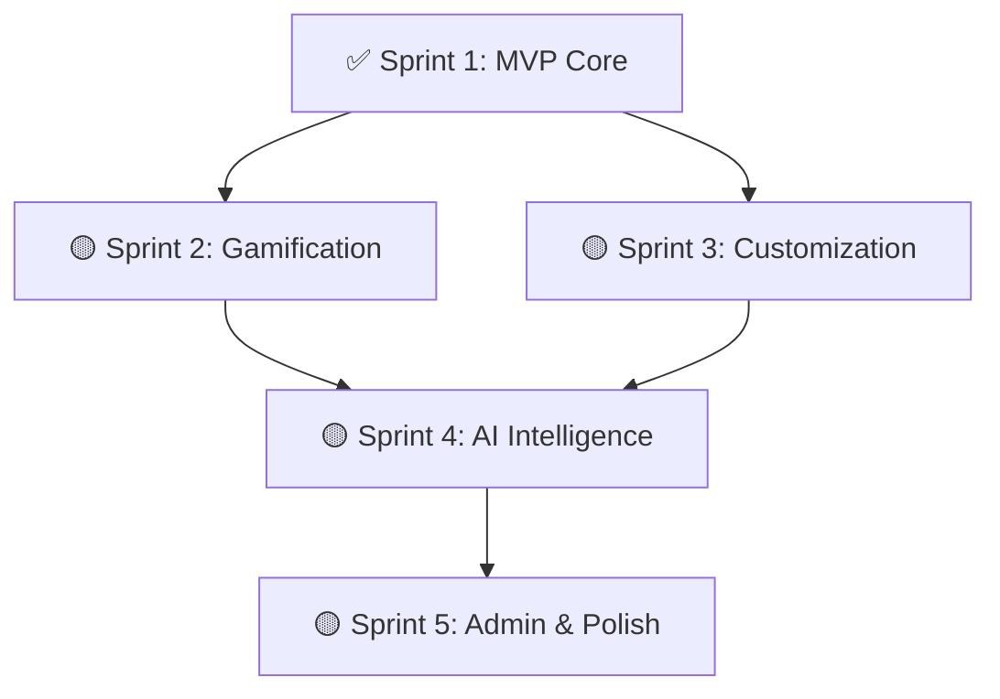

# Sprint Roadmap - StudyPlanAI

> Generated: 2026-03-26
> Version: 1.0
> Status: Sprint 1 completed, planned sprints 2-5

---

## 📊 Overview

| Metric | Value |
|--------|-------|
| **Total Sprints** | 5 |
| **Sprints Completed** | 1 (Sprint 1) |
| **Sprints Remaining** | 4 |
| **Total Story Points** | 176 |
| **Story Points Completed** | ~45 (Sprint 1) |
| **Story Points Remaining** | ~131 |
| **Estimated Timeline** | ~16-20 weeks (assuming 3-4 week sprints) |

---

## 🏃‍♂️ Sprint 1: MVP Core Foundation ✅ COMPLETED

**Timeline:** Week 1-3 (Completed)
**Story Points:** ~45

### Sprint Goal
Connect frontend and backend creating a functional MVP with AI plan generation, authentication, and core gamification.

### Features Implemented

| Feature | Status | US Stories | Points |
|---------|--------|------------|--------|
| **FE-01: Generación de Plan con IA** | ✅ Complete | US-01, US-02, US-03, US-04 | 15 |
| **FE-04: Sistema de XP y Niveles** | 🟡 Partial | US-10, US-11 | 7 |
| **FE-07: Chat con Tutor IA** | 🟡 Partial | US-19 | 3 |
| **FE-10: Creación de Módulos** | 🟡 Partial | US-27, US-28 | 5 |
| **FE-11: Hitos (Milestones)** | 🟡 Partial | US-30 | 2 |
| **FE-13: Vista General del Progreso** | 🟡 Partial | US-35, US-36 | 4 |
| **FE-16: Gestión de Usuarios** | 🟡 Partial | US-42 (mock) | 3 |

### Definition of Done (Sprint 1)
- ✅ Frontend and backend connected via API
- ✅ Authentication working with JWT
- ✅ AI plan generation functional (with OpenRouter integration)
- ✅ Basic dashboard with real data
- ✅ Plan creation and viewing UI
- ✅ XP system core implemented
- ✅ Database schema complete and seeded

### Acceptance Criteria
- ✅ Users can register and login
- ✅ Users can generate AI study plans
- ✅ Users can view plans with modules and milestones
- ✅ Users can complete milestones and earn XP
- ✅ Dashboard shows real-time progress

---

## 🚀 Sprint 2: Gamification Complete

**Timeline:** Week 4-7 (4 weeks)
**Estimated Story Points:** 35
**Dependency:** Sprint 1 Complete

### Sprint Goal
Complete the gamification system with real badges, rewards store, activity calendar, and full XP mechanics.

### Features to Implement

#### FE-04: Sistema de XP y Niveles (Complete)
| US Story | Description | Complexity | Points |
|----------|-------------|------------|--------|
| US-10 | Ganar XP por completar hitos (sound effects, celebration) | Medium | 5 |
| US-12 | Usar XP para desbloquear recompensas (Rewards Shop) | Medium | 8 |

#### FE-05: Rachas de Estudio (Complete)
| US Story | Description | Complexity | Points |
|----------|-------------|------------|--------|
| US-13 | Contador de rachas diarias (backend logic) | Low | 2 |
| US-14 | Visual feedback cuando se rompe racha | Medium | 3 |
| US-15 | Record personal de mejor racha | Low | 2 |

#### FE-06: Insignias y Logros (Complete)
| US Story | Description | Complexity | Points |
|----------|-------------|------------|--------|
| US-16 | Sistema de desbloqueo de badges (backend + frontend) | Low | 3 |
| US-17 | Ver colección de insignias (earned/locked) | Low | 2 |
| US-18 | Compartir insignia en redes sociales | Low | 3 |

#### FE-14: Calendario de Rachas
| US Story | Description | Complexity | Points |
|----------|-------------|------------|--------|
| US-38 | Ver calendario de actividad (30-day heatmap) | Medium | 5 |
| US-39 | Ver historial de rachas anteriores | Low | 3 |

**Total Sprint Points:** 36

### Definition of Done (Sprint 2)
- ✅ Full badge system with 8+ badge types
- ✅ Rewards store for spending XP
- ✅ Activity calendar heatmap on dashboard
- ✅ Streak system with visual/audio feedback
- ✅ Social sharing for badges
- ✅ All gamification features tested

### Acceptance Criteria
- ✅ Users earn XP with celebration animations and sounds
- ✅ Users can spend XP in Rewards Shop
- ✅ Users see 30-day activity heatmap
- ✅ Streak counter works correctly with daily tracking
- ✅ Badges unlock automatically based on achievements
- ✅ Users can share achievements on Twitter/X

---

## ✏️ Sprint 3: Plan Customization

**Timeline:** Week 8-11 (4 weeks)
**Estimated Story Points:** 32
**Dependency:** Sprint 1 Complete

### Sprint Goal
Enable users to fully customize their AI-generated plans with editing, history, and resource management.

### Features to Implement

#### FE-02: Edición y Personalización del Plan
| US Story | Description | Complexity | Points |
|----------|-------------|------------|--------|
| US-05 | Editar módulo existente (title, description, order) | Low | 2 |
| US-06 | Agregar módulo personalizado | Low | 3 |
| US-07 | Reordenar módulos con drag-and-drop | Medium | 5 |

#### FE-03: Historial de Planes
| US Story | Description | Complexity | Points |
|----------|-------------|------------|--------|
| US-08 | Ver versiones anteriores del plan | Low | 3 |
| US-09 | Restaurar versión anterior | Medium | 3 |

#### FE-11: Hitos (Milestones) (Complete)
| US Story | Description | Complexity | Points |
|----------|-------------|------------|--------|
| US-31 | Ver detalles del hito (modal) | Low | 2 |
| US-32 | Añadir fecha de vencimiento | Low | 2 |

#### FE-12: Recursos Adjuntos
| US Story | Description | Complexity | Points |
|----------|-------------|------------|--------|
| US-33 | Adjuntar enlace a hito | Low | 2 |
| US-34 | Adjuntar notas personales | Low | 2 |

#### FE-13: Vista General del Progreso (Complete)
| US Story | Description | Complexity | Points |
|----------|-------------|------------|--------|
| US-37 | Ver fecha estimada de finalización | Medium | 3 |

#### FE-29: Módulo completado con animación
| US Story | Description | Complexity | Points |
|----------|-------------|------------|--------|
| US-29 | Celebración al completar módulo (confetti, sound) | Medium | 3 |

**Total Sprint Points:** 30

### Definition of Done (Sprint 2)
- ✅ Users can edit module properties
- ✅ Users can add custom modules to plans
- ✅ Drag-and-drop reordering for modules
- ✅ Plan versioning with history view
- ✅ Restore previous plan versions
- ✅ Milestone details modal with editing
- ✅ Due dates for milestones
- ✅ Resources attached to milestones (links, notes)
- ✅ Estimated completion date calculation
- ✅ Module completion celebration

### Acceptance Criteria
- ✅ Users can edit any module's title and description
- ✅ Users can add new modules between existing ones
- ✅ Users can drag-and-drop modules to reorder
- ✅ Plan history shows all versions with timestamps
- ✅ Users can restore any previous plan version
- ✅ Milestones show due dates with calendar picker
- ✅ Users can attach links and notes to milestones
- ✅ Completing final milestone triggers celebration
- ✅ Dashboard shows estimated completion date

---

## 🤖 Sprint 4: AI Intelligence

**Timeline:** Week 12-15 (4 weeks)
**Estimated Story Points:** 35
**Dependency:** Sprint 2 Complete

### Sprint Goal
Enhance AI Tutor with contextual help, automated reports, and dynamic plan adjustments.

### Features to Implement

#### FE-07: Chat con Tutor IA (Complete)
| US Story | Description | Complexity | Points |
|----------|-------------|------------|--------|
| US-20 | Recibir ayuda contextual (aware of current module) | High | 8 |
| US-21 | Recibir aliento y motivación (sentiment analysis) | Medium | 5 |

#### FE-08: Reportes Automatizados
| US Story | Description | Complexity | Points |
|----------|-------------|------------|--------|
| US-22 | Recibir resumen semanal (scheduled + in-app) | Medium | 5 |
| US-23 | Ver estadísticas de progreso (detailed stats view) | Medium | 5 |

#### FE-09: Ajuste Dinámico de Planes
| US Story | Description | Complexity | Points |
|----------|-------------|------------|--------|
| US-24 | AI detecta patrones de progreso | High | 8 |
| US-25 | Sugerir ajustes de plan (with preview) | Medium | 5 |
| US-26 | Aceptar ajuste automático (opt-in) | High | 8 |

#### FE-15: Galería de Logros
| US Story | Description | Complexity | Points |
|----------|-------------|------------:--------|
| US-40 | Ver logros recientes (dashboard widget) | Low | 2 |
| US-41 | Ver estadísticas motivacionales (profile stats) | Low | 2 |

**Total Sprint Points:** 40

### Definition of Done (Sprint 2)
- ✅ AI Tutor provides contextual help based on current study
- ✅ AI Tutor offers motivational support (sentiment detection)
- ✅ Weekly progress summaries generated automatically
- ✅ Detailed statistics dashboard for users
- ✅ AI detects when users fall behind schedule
- ✅ AI suggests plan adjustments with preview
- ✅ Auto-adjustment feature available as opt-in setting
- ✅ Recent achievements displayed on dashboard
- ✅ Motivational stats on profile page

### Acceptance Criteria
- ✅ AI Tutor references current module in responses
- ✅ AI Tutor detects user frustration/motivation levels
- ✅ Weekly summaries sent every Sunday at 6 PM
- ✅ Users can view detailed study statistics
- ✅ AI detects patterns (missed milestones, low activity)
- ✅ AI suggests plan adjustments with clear diffs
- ✅ Auto-adjustment can be enabled in settings
- ✅ Dashboard shows 3 most recent achievements
- ✅ Profile shows total study time and encouraging stats

---

## 🛠️ Sprint 5: Admin & Polish

**Timeline:** Week 16-19 (4 weeks)
**Estimated Story Points:** 30
**Dependency:** Sprint 4 Complete

### Sprint Goal
Complete admin panel with user management, AI configuration, and system analytics. Polish all features for production readiness.

### Features to Implement

#### FE-16: Gestión de Usuarios (Complete)
| US Story | Description | Complexity | Points |
|----------|-------------|------------|--------|
| US-42 | Ver lista de usuarios (searchable, filtered) | Low | 3 |
| US-43 | Editar usuario (deactivate, modify) | Low | 2 |
| US-44 | Ver actividad de usuario (detailed activity log) | Medium | 3 |

#### FE-17: Configuración de IA
| US Story | Description | Complexity | Points |
|----------|-------------|------------|--------|
| US-45 | Seleccionar modelo de IA (OpenRouter models) | Medium | 5 |
| US-46 | Configurar parámetros de IA (creativity, verbosity, tone) | Medium | 5 |

#### FE-18: Analytics del Sistema
| US Story | Description | Complexity | Points |
|----------|-------------|------------|--------|
| US-47 | Ver métricas de uso (DAU, MAU, completion rates) | Medium | 5 |
| US-48 | Exportar reportes (CSV, PDF) | Low | 3 |

#### Polish Tasks (Non-Story Points)
| Task | Description | Priority |
|------|-------------|----------|
| Performance | Optimize page loads (< 2s target) | High |
| Mobile Responsive | Test and fix all mobile views | High |
| Error Handling | Improve error messages and recovery | Medium |
| Accessibility | Add ARIA labels and keyboard navigation | Medium |
| Testing | Add unit tests for critical paths | High |
| Security | Audit and fix security vulnerabilities | High |
| Documentation | Update README with deployment guide | Low |

**Total Sprint Points:** 26

### Definition of Done (Sprint 5)
- ✅ Admin panel fully functional
- ✅ User management with search, filter, edit capabilities
- ✅ AI model selection and parameter configuration
- ✅ System analytics dashboard with real-time metrics
- ✅ Export functionality for reports
- ✅ Performance targets met (Lighthouse score > 90)
- ✅ Mobile responsive across all pages
- ✅ Critical paths unit tested (80%+ coverage)
- ✅ Security audit completed with high score
- ✅ Production deployment guide complete

### Acceptance Criteria
- ✅ Admin can view, search, and filter all users
- ✅ Admin can deactivate/activate user accounts
- ✅ Admin can view detailed user activity logs
- ✅ Admin can switch between AI models (Llama, GPT, etc.)
- ✅ Admin can adjust AI parameters (temperature, max_tokens, etc.)
- ✅ Admin dashboard shows platform-wide metrics
- ✅ Admin can export analytics as CSV/PDF
- ✅ All pages load under 2 seconds
- ✅ App is fully functional on mobile iOS/Android
- ✅ Unit tests cover authentication, plans, gamification
- ✅ Security vulnerabilities addressed
- ✅ Deployment documentation complete

---

## 📈 Sprint Timeline Summary

```
Sprint 1  ████████████████████ Week 1-3  ✅ COMPLETED (45 pts)
Sprint 2  ████████████████████ Week 4-7  🟡 GAMIFICATION (36 pts)
Sprint 3  ████████████████████ Week 8-11 🟡 CUSTOMIZATION (30 pts)
Sprint 4  ████████████████████ Week 12-15 🟡 AI INTELLIGENCE (40 pts)
Sprint 5  ████████████████████ Week 16-19 🟡 ADMIN & POLISH (26 pts)

Total: 19 weeks (~5 months)
Story Points: 177 total
```

---

## 🎯 Dependencies Map



**Critical Path:** Sprint 1 → Sprint 2 → Sprint 4 → Sprint 5

**Parallel Tracks:**
- Sprint 3 can start after Sprint 1 (no dependency on Sprint 2)
- Sprint 5 depends on Sprints 2, 3, and 4

---

## 🎯 Sprint Priorities (MoSCoW for Remaining)

### Must Have (Sprint 2, 3)
- Badge system (US-16, US-17)
- Rewards Shop (US-12)
- Activity Calendar (US-38)
- Plan Editing (US-05, US-06, US-07)
- Plan History (US-08, US-09)
- Milestone Resources (US-33, US-34)

### Should Have (Sprint 4)
- Contextual AI help (US-20)
- Emotional support (US-21)
- Weekly reports (US-22)
- AI pattern detection (US-24)
- Plan adjustment suggestions (US-25)

### Could Have (Sprint 5)
- Admin panel features (US-42 to US-48)
- Advanced AI auto-adjustment (US-26)
- Social sharing (US-18)

### Won't Have (Future Sprints)
- Collaborative study groups
- Video conferencing integration
- Advanced analytics for students
- Mobile app (native)

---

## 📊 Story Points by Sprint

| Sprint | Stories | Points | Cumulative |
|--------|---------|--------|------------|
| Sprint 1 | ~12 | ~45 | 45 (25%) |
| Sprint 2 | ~9 | 36 | 81 (46%) |
| Sprint 3 | ~8 | 30 | 111 (63%) |
| Sprint 4 | ~9 | 40 | 151 (85%) |
| Sprint 5 | ~7 | 26 | 177 (100%) |

---

## 🎉 Sprint Completion Celebration Ideas

- **After Sprint 2:** "Level Up!" - Celebrate full gamification system
- **After Sprint 3:** "Master Planner" - Celebrate complete plan customization
- **After Sprint 4:** "AI Genius" - Celebrate intelligent AI features
- **After MVP:** Feature blog post announcement
- Share progress on social media with milestone screenshots

---

## 📝 Notes

- **Sprint Duration:** 4 weeks recommended (flexible based on team velocity)
- **Story Point Estimation:** Based on complexity (Low=2-3, Medium=5, High=8)
- **Team Size:** Assumes 1-2 developers
- **Parallel Work:** Sprint 3 can overlap with Sprint 2
- **Buffer:** Include 20% buffer in each sprint for unexpected work
- **Review Points:** Demo at end of each sprint for stakeholder feedback

---

## 🔜 Next Steps

### Immediate (Start Sprint 2)
1. Complete badge backend implementation
2. Build Rewards Shop UI
3. Implement activity calendar heatmap
4. Add streak visual/audio feedback
5. Test all gamification features end-to-end

### Planning (Before Sprint 3)
1. Refine custom UI components (drag-drop, modals)
2. Design plan history UI
3. Plan versioning strategy (data structure)
4. Create detailed technical designs for editing features

### Long-term (Before Sprint 5)
1. Start performance optimization early
2. Begin security audit midway
3. Prepare production deployment checklist
4. Create user testing feedback loop

---

**Roadmap Version:** 1.0
**Last Updated:** 2026-03-26
**Created By:** Based on requirements.md and current implementation status
